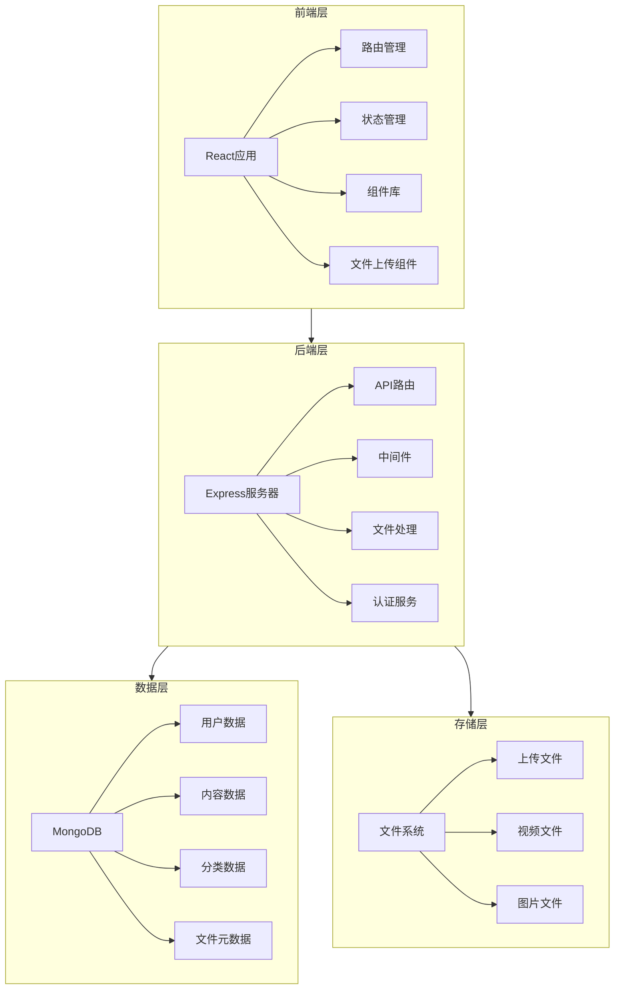

# 架构设计文档

## 1. 系统架构图



## 2. 系统分层架构

### 2.1 前端架构

#### 2.1.1 模块划分

| 模块 | 职责 | 文件位置 |
|-----|------|----------|
| 核心模块 | 应用入口和全局配置 | `/src/App.tsx`, `/src/index.tsx` |
| 路由模块 | 页面路由管理 | `/src/routes/` |
| 组件模块 | 可复用UI组件 | `/src/components/` |
| 页面模块 | 业务页面 | `/src/pages/` |
| 服务模块 | API调用和数据处理 | `/src/services/` |
| 工具模块 | 通用工具函数 | `/src/utils/` |
| 类型模块 | TypeScript类型定义 | `/src/types/` |

#### 2.1.2 关键组件

| 组件 | 职责 | 技术实现 |
|-----|------|----------|
| FileUploader | 文件上传组件 | React Dropzone + 自定义上传逻辑 |
| FileManager | 文件管理组件 | 自定义文件夹树 + 文件列表 |
| CategoryManager | 分类管理组件 | 递归组件 + 拖拽排序 |
| NavigationBar | 导航栏组件 | React Router + 自定义高亮逻辑 |
| ResponsiveLayout | 响应式布局 | Tailwind CSS + 媒体查询 |

#### 2.1.3 状态管理

- **全局状态**: React Context + useReducer
- **局部状态**: React useState + useEffect
- **异步状态**: React Query

### 2.2 后端架构

#### 2.2.1 模块划分

| 模块 | 职责 | 文件位置 |
|-----|------|----------|
| 核心模块 | 服务器配置和启动 | `/src/server.ts`, `/src/app.ts` |
| 路由模块 | API路由定义 | `/src/routes/` |
| 控制器模块 | 请求处理逻辑 | `/src/controllers/` |
| 服务模块 | 业务逻辑 | `/src/services/` |
| 模型模块 | 数据模型 | `/src/models/` |
| 中间件模块 | 请求拦截和处理 | `/src/middleware/` |
| 工具模块 | 通用工具函数 | `/src/utils/` |
| 配置模块 | 应用配置 | `/src/config/` |

#### 2.2.2 关键服务

| 服务 | 职责 | 技术实现 |
|-----|------|----------|
| UploadService | 文件上传处理 | Multer + 自定义分片逻辑 |
| FileService | 文件管理服务 |  fs + 路径处理 |
| CategoryService | 分类管理服务 | MongoDB + 递归处理 |
| AuthService | 用户认证服务 | JWT + 密码加密 |
| ContentService | 内容管理服务 | MongoDB + 关联查询 |

#### 2.2.3 API设计

| API路径 | 方法 | 模块 | 功能描述 |
|---------|------|------|----------|
| `/api/auth/*` | POST | 认证模块 | 用户登录、注册、刷新令牌 |
| `/api/files/*` | GET/POST/PUT/DELETE | 文件模块 | 文件上传、下载、管理 |
| `/api/categories/*` | GET/POST/PUT/DELETE | 分类模块 | 分类创建、修改、删除 |
| `/api/content/*` | GET/POST/PUT/DELETE | 内容模块 | 文章和媒体内容管理 |
| `/api/users/*` | GET/PUT/DELETE | 用户模块 | 用户信息管理 |

### 2.3 数据架构

#### 2.3.1 数据模型

| 模型 | 字段 | 类型 | 描述 |
|-----|------|------|----------|
| User | `_id`, `username`, `email`, `password`, `createdAt`, `updatedAt` | ObjectId, String, String, String, Date, Date | 用户信息 |
| Category | `_id`, `name`, `parentId`, `level`, `createdAt`, `updatedAt` | ObjectId, String, ObjectId, Number, Date, Date | 分类信息 |
| Content | `_id`, `title`, `content`, `categoryId`, `userId`, `type`, `createdAt`, `updatedAt` | ObjectId, String, String, ObjectId, ObjectId, String, Date, Date | 内容信息 |
| File | `_id`, `name`, `path`, `size`, `type`, `userId`, `folderId`, `createdAt`, `updatedAt` | ObjectId, String, String, Number, String, ObjectId, ObjectId, Date, Date | 文件信息 |
| Folder | `_id`, `name`, `parentId`, `userId`, `createdAt`, `updatedAt` | ObjectId, String, ObjectId, ObjectId, Date, Date | 文件夹信息 |

#### 2.3.2 数据关系

| 关系 | 类型 | 描述 |
|-----|------|----------|
| User -> Content | 一对多 | 用户创建多个内容 |
| User -> File | 一对多 | 用户上传多个文件 |
| User -> Folder | 一对多 | 用户创建多个文件夹 |
| Category -> Content | 一对多 | 分类包含多个内容 |
| Folder -> File | 一对多 | 文件夹包含多个文件 |
| Folder -> Folder | 自关联 | 文件夹嵌套 |
| Category -> Category | 自关联 | 分类层级 |

### 2.4 存储架构

#### 2.4.1 文件存储结构

```
/uploads
  /users
    /{userId}
      /files
        /{fileId}.{ext}
      /videos
        /{videoId}.{ext}
      /images
        /{imageId}.{ext}
      /folders
        /{folderId}
          /{fileId}.{ext}
```

#### 2.4.2 存储策略

| 文件类型 | 存储策略 | 处理方式 |
|---------|----------|----------|
| 图片文件 | 原图 + 缩略图 | 生成多种尺寸缩略图 |
| 视频文件 | 原视频 + 预览图 | 生成视频预览帧 |
| 文档文件 | 原文档 + 索引 | 提取文本内容用于搜索 |
| 其他文件 | 原样存储 | 直接保存 |

## 3. 模块依赖关系

### 3.1 前端依赖

| 依赖 | 版本 | 用途 | 模块 |
|-----|------|------|------|
| React | 18.x | 前端框架 | 全局 |
| TypeScript | 5.x | 类型系统 | 全局 |
| Tailwind CSS | 3.x | 样式框架 | 组件 |
| React Router | 6.x | 路由管理 | 路由模块 |
| React Dropzone | 14.x | 文件上传 | 文件上传模块 |
| Axios | 1.x | HTTP客户端 | 服务模块 |
| React Query | 4.x | 数据请求 | 服务模块 |
| Zustand | 4.x | 状态管理 | 全局 |

### 3.2 后端依赖

| 依赖 | 版本 | 用途 | 模块 |
|-----|------|------|------|
| Express | 4.x | Web框架 | 全局 |
| MongoDB | 6.x | 数据库 | 数据模块 |
| Mongoose | 7.x | ODM | 数据模块 |
| Multer | 1.x | 文件上传 | 文件模块 |
| JWT | 9.x | 认证 | 认证模块 |
| bcrypt | 5.x | 密码加密 | 认证模块 |
| cors | 2.x | CORS中间件 | 全局 |
| dotenv | 16.x | 环境变量 | 配置模块 |

## 4. 接口契约

### 4.1 认证接口

| API路径 | 方法 | 请求体 | 成功响应 | 失败响应 |
|---------|------|--------|----------|----------|
| `/api/auth/register` | POST | `{username, email, password}` | `{token, user}` | `{error: string}` |
| `/api/auth/login` | POST | `{email, password}` | `{token, user}` | `{error: string}` |
| `/api/auth/refresh` | POST | `{refreshToken}` | `{token}` | `{error: string}` |

### 4.2 文件接口

| API路径 | 方法 | 请求体 | 成功响应 | 失败响应 |
|---------|------|--------|----------|----------|
| `/api/files/upload` | POST | `FormData` | `{fileId, filename, size, type}` | `{error: string}` |
| `/api/files/list` | GET | N/A | `[{id, name, size, type, path}]` | `{error: string}` |
| `/api/files/:id` | GET | N/A | 文件流 | `{error: string}` |
| `/api/files/:id` | DELETE | N/A | `{success: true}` | `{error: string}` |

### 4.3 分类接口

| API路径 | 方法 | 请求体 | 成功响应 | 失败响应 |
|---------|------|--------|----------|----------|
| `/api/categories` | GET | N/A | `[{id, name, parentId, level}]` | `{error: string}` |
| `/api/categories` | POST | `{name, parentId}` | `{id, name, parentId, level}` | `{error: string}` |
| `/api/categories/:id` | PUT | `{name, parentId}` | `{id, name, parentId, level}` | `{error: string}` |
| `/api/categories/:id` | DELETE | N/A | `{success: true}` | `{error: string}` |

### 4.4 内容接口

| API路径 | 方法 | 请求体 | 成功响应 | 失败响应 |
|---------|------|--------|----------|----------|
| `/api/content` | GET | N/A | `[{id, title, content, categoryId, userId, type}]` | `{error: string}` |
| `/api/content` | POST | `{title, content, categoryId, type}` | `{id, title, content, categoryId, userId, type}` | `{error: string}` |
| `/api/content/:id` | PUT | `{title, content, categoryId, type}` | `{id, title, content, categoryId, userId, type}` | `{error: string}` |
| `/api/content/:id` | DELETE | N/A | `{success: true}` | `{error: string}` |

## 5. 异常处理策略

### 5.1 前端异常处理

| 异常类型 | 处理方式 | 展示方式 |
|---------|----------|----------|
| API请求异常 | 全局错误拦截 | 错误提示弹窗 |
| 表单验证异常 | 实时验证 | 表单字段错误提示 |
| 文件上传异常 | 上传组件处理 | 上传失败提示 |
| 路由异常 | 404页面 | 404错误页面 |

### 5.2 后端异常处理

| 异常类型 | 处理方式 | 响应方式 |
|---------|----------|----------|
| 数据库异常 | 全局错误中间件 | 500错误 + 错误信息 |
| 认证异常 | 认证中间件 | 401错误 + 错误信息 |
| 权限异常 | 权限中间件 | 403错误 + 错误信息 |
| 验证异常 | 验证中间件 | 400错误 + 错误信息 |
| 资源异常 | 路由处理 | 404错误 + 错误信息 |

## 6. 集成方案

### 6.1 开发环境集成

| 工具 | 用途 | 配置文件 |
|-----|------|----------|
| Vite | 前端构建工具 | `vite.config.ts` |
| ESLint | 代码检查 | `.eslintrc` |
| Prettier | 代码格式化 | `.prettierrc` |
| Husky | Git钩子 | `.husky/` |
| Jest | 前端测试 | `jest.config.js` |
| Supertest | 后端测试 | `package.json` |

### 6.2 部署环境集成

| 工具 | 用途 | 配置文件 |
|-----|------|----------|
| Docker | 容器化部署 | `Dockerfile`, `docker-compose.yml` |
| NGINX | 反向代理 | `nginx.conf` |
| PM2 | 进程管理 | `ecosystem.config.js` |
| Let's Encrypt | SSL证书 | N/A |

## 7. 性能优化策略

### 7.1 前端优化

| 优化项 | 实现方式 | 效果 |
|-------|----------|------|
| 代码分割 | React.lazy + Suspense | 减少初始加载时间 |
| 图片优化 | 懒加载 + 响应式图片 | 减少带宽使用 |
| 缓存策略 | 浏览器缓存 + Service Worker | 提高重复访问速度 |
| 资源压缩 | Vite构建优化 | 减少文件大小 |
| 状态管理 | 局部状态 + 选择性渲染 | 提高渲染性能 |

### 7.2 后端优化

| 优化项 | 实现方式 | 效果 |
|-------|----------|------|
| 数据库索引 | 合理创建索引 | 提高查询速度 |
| 缓存机制 | Redis缓存 | 减少数据库负载 |
| 并发处理 | 异步IO + 集群 | 提高并发能力 |
| 文件处理 | 流式处理 + 分片上传 | 支持大文件上传 |
| API优化 | 分页 + 字段过滤 | 减少数据传输 |

### 7.3 存储优化

| 优化项 | 实现方式 | 效果 |
|-------|----------|------|
| 文件压缩 | 图片压缩 + 视频转码 | 减少存储占用 |
| 存储分层 | 热数据 + 冷数据 | 优化存储成本 |
| 备份策略 | 增量备份 + 异地备份 | 提高数据安全性 |
| 访问控制 | 签名URL + 过期时间 | 提高访问安全性 |

## 8. 安全策略

### 8.1 前端安全

| 安全项 | 实现方式 | 效果 |
|-------|----------|------|
| XSS防护 | React自动转义 + CSP | 防止跨站脚本攻击 |
| CSRF防护 | 令牌验证 | 防止跨站请求伪造 |
| 输入验证 | 表单验证 + 类型检查 | 防止恶意输入 |
| 敏感信息 | 不存储敏感信息 | 保护用户数据 |

### 8.2 后端安全

| 安全项 | 实现方式 | 效果 |
|-------|----------|------|
| 认证授权 | JWT + 权限检查 | 保护API访问 |
| 密码安全 | bcrypt加密 | 保护用户密码 |
| 文件验证 | 文件类型检查 + 病毒扫描 | 防止恶意文件 |
| 速率限制 | 限流中间件 | 防止暴力攻击 |
| 日志审计 | 安全日志 + 监控 | 追踪异常行为 |

### 8.3 存储安全

| 安全项 | 实现方式 | 效果 |
|-------|----------|------|
| 文件权限 | 最小权限原则 | 保护文件访问 |
| 加密存储 | 敏感文件加密 | 保护敏感数据 |
| 访问控制 | 基于角色的访问控制 | 限制文件访问 |
| 备份恢复 | 定期备份 + 灾难恢复 | 防止数据丢失 |